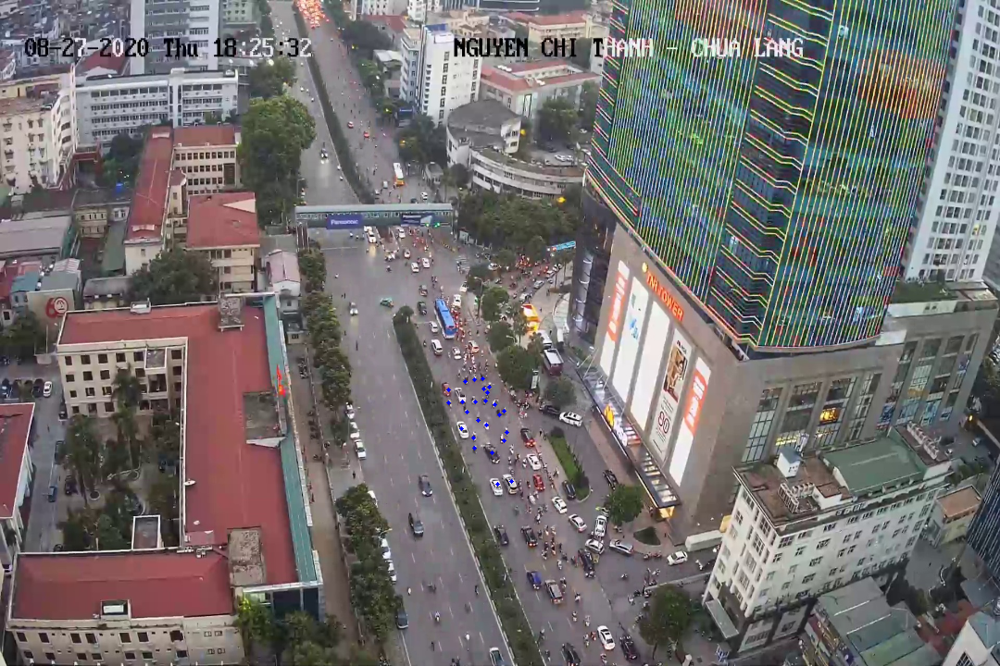

## Tool label for crowded counting
# Requirements:
- python3
- packages python3: opencv-python, numpy
- source: 
- folder images need label
# Tool and arguements:
    - Follow command to run tool:
```
    python3  label.py -p/--path [path/to/image_dataset] -z/--height [the height of image want to scale] -w/--width [the width of image want to scale]
```
* `-p` or `--path` : path to dataset folder
(Optional) if image too large and your monitor can't display entire images, you need to scale smaller then origin image, to do that fill up 2 arguements `-z` and `-w`.
* `-z` or `--height` : the height of image want to scale
* `-w` or `--width` : the width of image want to scale



# Hoykey:
`c`: clear all dot label

`z`: undo dot label

`s`: save dots label

`q`: next image